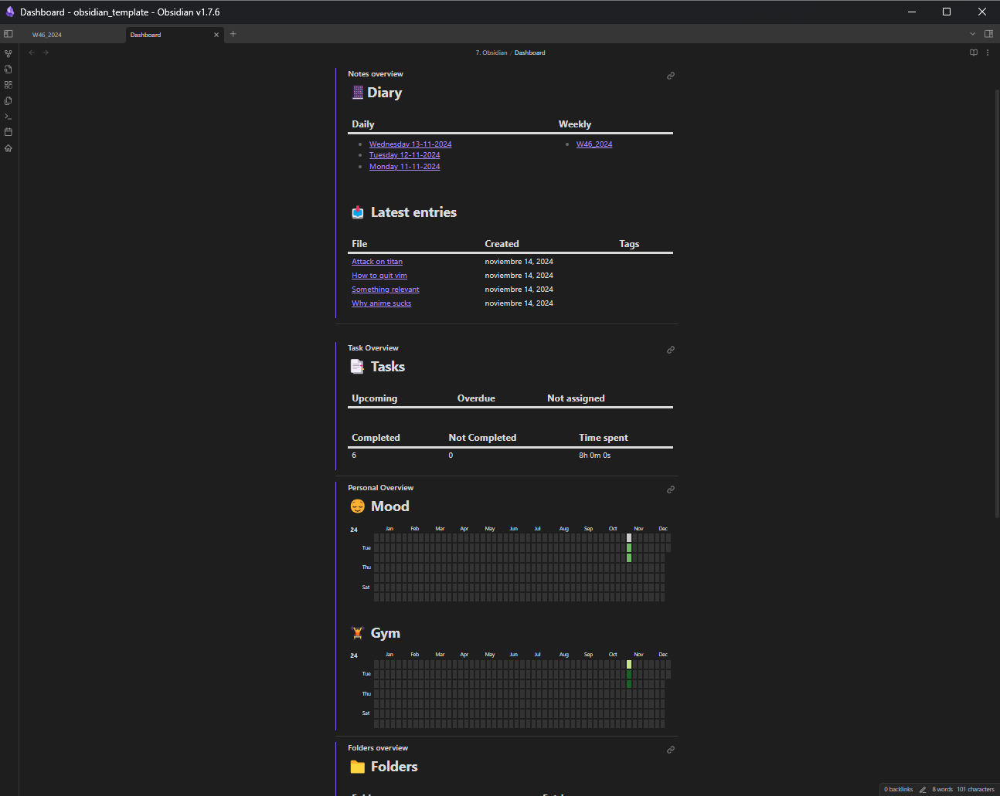
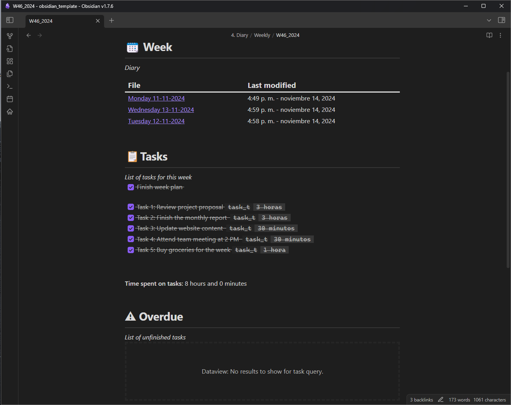
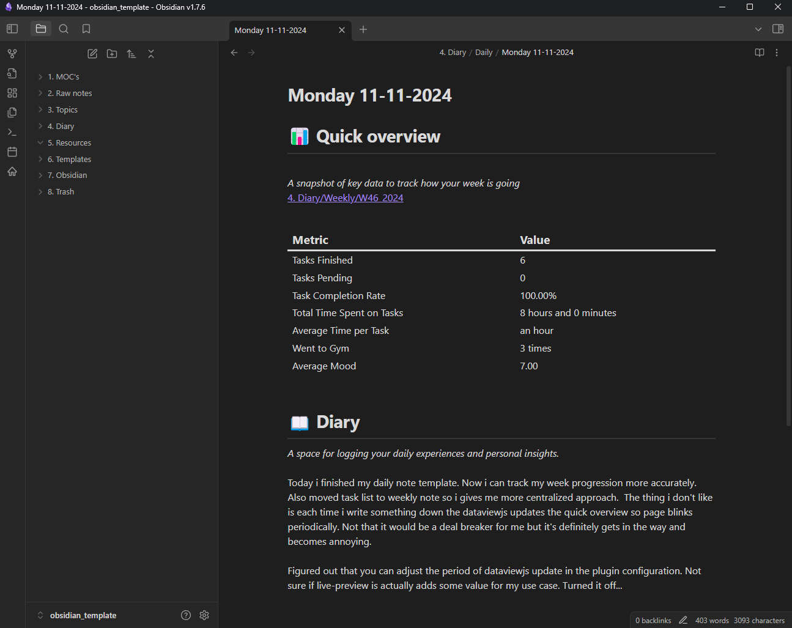

# Obsidian Template

This is my Obsidian template. Feel free to use it however you like. I tried to keep it as minimal as possible. The following plugins are used:

- **Homepage**
- **Dataview**
- **Heatmap**
- **Calendar** (optional)
- **TikZlax** (optional)

The last two plugins are not essential for the workflow, so you can remove them at any time without affecting functionality.

## Workflow

1. **Weekly Note**: Create a weekly note to organize all your tasks. Use the metadata `[task_t::time]` to log the time spent on each task.
2. **Daily Note**: Use the daily note as a diary to record important events and ideas from each day.
3. **Dashboard**: The dashboard provides an overview of your vault.

---

### Weekly Note

All tasks are managed in the weekly note, which provides a centralized approach for task management. I use `[task_t::time]` to track the time spent on each task.

### Daily Note

The daily note provides a snapshot of your weekly progress. I use it as a diary to quickly jot down ideas and note relevant events from each day.

### Dashboard

The dashboard offers an overview of the vault. It’s simple but functional. I use embedded links to reference blocks, which keeps the logic separated across files. This way, if I need to make changes, I don’t have to edit all the DataviewJS code directly.

---

## Screenshots

